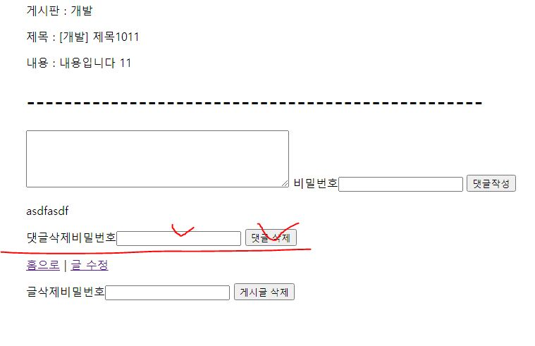

# 웹페이지 구축 미션 프로젝트

## 프로젝트 설명 
### 1. 필수 요구사항을 구현한 방식에 대한 기초적인 설명을 첨부  
###   1.1 기본 entity관계. 
   - article(게시글) - comment(댓글)로 이루어져있다.
   - 하나의 게시글(OneToMany)에 여러 댓글(ManyToOne)이 올 수 있다.
      
###   1.2 기본 구조.
###     - 템플릿 : boards / create / show / update / searh
       - boards : 전체게시판 / 자유게시판 / 개발게시판 / 일상게시판 / 사건사고게시판 이 있다.
         - 각 게시판의 글들은 최신글이 맨 위로 올라온다.
       - create : 글을 작성할 수 있다. 게시판 선택이 가능하며, 제목과 내용을 작성할 수 있다. 
         - 비밀번호를 입력하여, 추후 수정 / 삭제 시 본인 체크 가능
       - show : 게시글 보기 기능. 작성한 게시판 / 제목 / 내용이 나타난다.
         - 글 삭제와 수정이 이곳에서 이루어진다.
         - 댓글을 작성할 수 있다.
           - 비밀번호를 입력하여, 추후 삭제 시 본인 체크 가능
           - 댓글 삭제가 가능하다.
       - update : 작성한 글의 수정이 가능하다.
         - 기존 선택했던 게시판 / 작성했던 제목 / 내용이 나타나며, 수정 가능하다.
           - 새로운 비밀번호를 입력해야한다.
           - 수정 사항을 반영하기 위해서는, 글 생성 시 입력하였던 비밀번호를 입력해야만 한다.
       - search : 게시글 검색이 가능하다.
         - 전체게시판 / 게시판별 검색이 가능하다.
         - 제목 / 내용으로 검색이 가능하다.
###     - 컨트롤러 : BoardController / ArticleController
       - BoardController : 게시판 관련 기능과 연결해준다.
         - 게시판 보기 / 게시글 작성 / 게시판 내 검색
###     - 서비스 : ArticleService / CommentService
       - ArticleService : 게시글 관련 기능 제공
       - CommentService : 댓글 관련 기능 제공
###     - 레포지토리 : ArticleRepository / CommentRepository
       - ArticleRepository : 게시글 관련 DB 소통
       - CommentRepository : 댓글 관련 DB 소통
###     - 엔티티 : Article / Comment
     - Article : 게시글.
     - Comment : 댓글.
     
--- 
## 프로젝트 실행 방법
- `최초 실행시 `jpa.hiberante.ddl-auto: create` 의 설정으로 실행  
이후 update로 실행`
- port : 9091 사용
### 1. 게시판 탐색
전체게시판은  http://localhost:9091/boards/0 으로 접속  
  
 
개별게시판은 상단의 네비게이션바 이용  

### 2. 글쓰기  
게시판 하단의 글쓰기 버튼 이용  
  
게시판선택 / 제목입력 / 내용입력 / 비밀번호 등록을 마친 후 등록버튼 클릭  

### 3. 검색  
게시판 상단의 검색바 이용  
제목 / 내용으로 검색 가능  
전체게시판에서 검색 시 전체게시물 검색 / 개별게시판에서 검색 시 개별게시물 검색됨   

### 4. 게시글 보기    
하나의 게시글 보기 가능  
  
게시판에서 하나의 게시글 클릭  
게시물의 어떤게시판인지 / 제목 / 내용 / 댓글을 확인 가능하다.  
게시물의 수정 / 삭제가 이곳에서 가능하다.  

### 5. 게시글 수정
게시글로 들어가 글 수정 버튼 클릭  
  
게시판 / 제목 / 내용 수정 후, 글생성 시 입력한 비밀번호 / 새 비밀번호 입력.  
생성 시 입력한 비밀번호와 일치하면 수정 후 게시글으로 이동 / 불일치 시 저장 안됨 

### 6. 게시글 삭제
게시글 보기 페이지 하단에 있는 게시글 삭제 버튼 이용.  
글 생성 시 입력한 비밀번호와 일치할 시 삭제 / 불일치 시 삭제 안됨  
  

### 7. 댓글 생성  
게시글 보기 페이지 하단의 댓글입력창에서 생성 가능
- 게시글 생성때처럼, 비밀번호를 입력해줘야한다.  
  
### 8. 댓글 삭제
게시글 보기 페이지 하단의 댓글 삭제 버튼 이용.
- 댓글 생성 시 입력한 비밀번호와 일치하면 삭제 / 불일치 시 삭제 안됨  
  
--- 
### 진행중 발생한 어려움에 대한 기록.
   - 시작을 어떻게 해야할지 어려웠다.  
   - 어떤 페이지를 어떤 컨트롤러로 연결시켜, 어떤 서비스에서 어떤 쿼리로 소통해야하는지 전체적인 틀을 잡는게 어려웠다. 
   - 틀을 잡았음에도, 놓치고 있던 부분이 나타나 수정할 때, 여러 부분들을 뜯어고쳐야하는 부분이 어려웠다.
   - 테스트를 하며 나타나는 각종 에러들이 어디에서 정확히 시작되는지 파악하는것이 쉽지않았다.
   - 새로운 기능 추가 시, 여러 부분들을 고치고, 또 새로 테스트하는 부분들이 어려웠다.

### 작성 기록
https://github.com/mafatofu/Mission_yeongkyulee/commits/main/

    